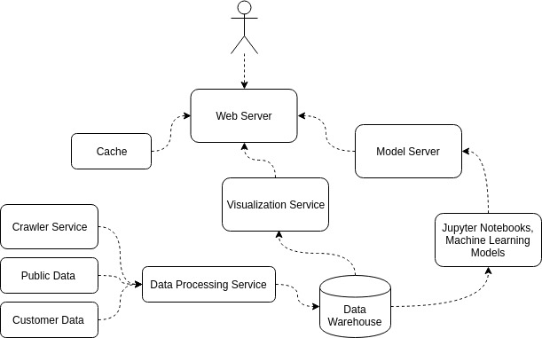
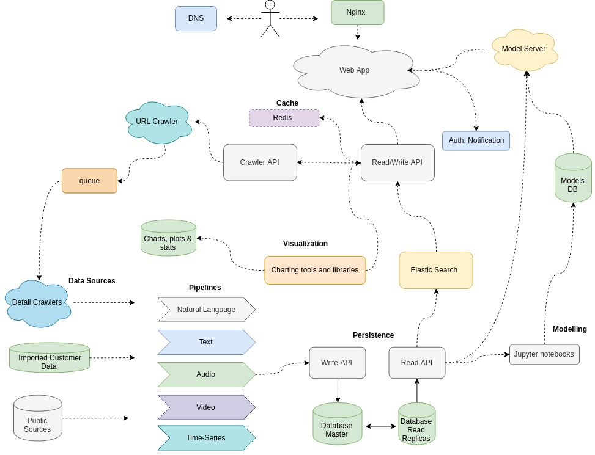
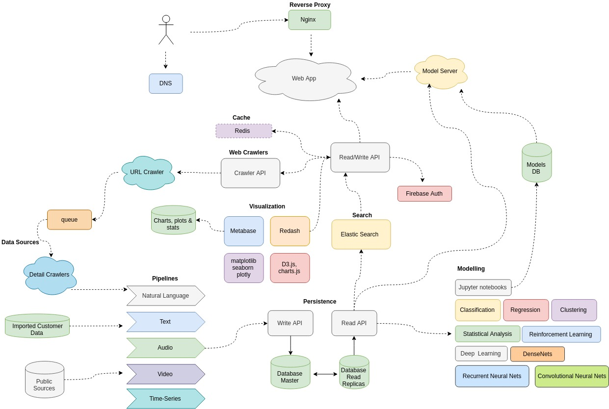

# Data, in brief
Turn data to answers, insight, and profit. 

## Use cases
+ automated market analysis
+ valuation
+ recommendation
+ decision support 
+ unify separate data sources

## Architecture
### Simplified 

### in more detail

### even more detail

